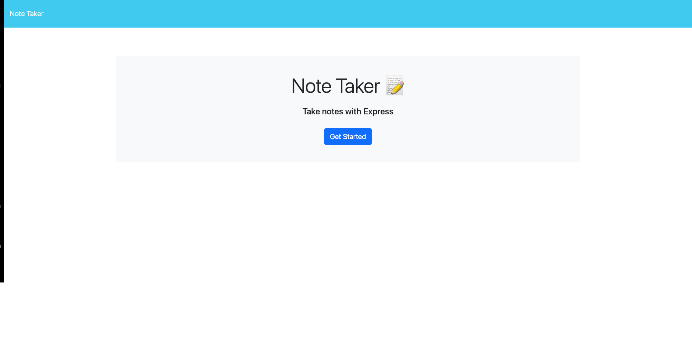
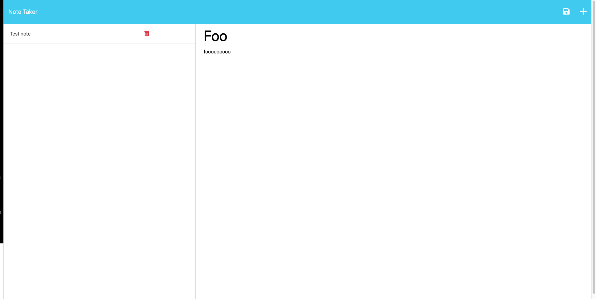

# Note Taker App

## Description

This is a web application meant to be used to write and save notes. The backend of this app is designed to send the note data back and forth over an express server, tracking the data in a JSON file.

## Table of Contents

- [Installation](#installation)

- [Usage](#usage)

- [License](#license)

- [Contributing](#contributing)

- [Questions](#Questions)

## Installation

N/A

## Usage

The application may be accessed at the URL link provided above. The user may enter input for a note title and and text body. When both fields contain input, a save button will appear. Clicking the save button will send a POST request over the express server where then the backend will save the note data in the db.json file. The app will update the notes list based on the array of notes it's pulling from the json file over the server. The user may also delete notes by clicking the trash icon next to the note they desire to delete. This will send a DELETE request over the server and the backend will remove the intended note from the json file matching the unique id included in the DELETE request. A wildcard route has been assigned to point users to the landing page, and the /notes route will send the notes.html file for the user to view. Requesting API data is possible by including /api/notes on the request URL.

## License

MIT

## Contributing

N/A

## Questions

My Github profile is https://github.com/therealsweven/.
Please reach out to borntobebobby@gmail.com with any additional questions.
